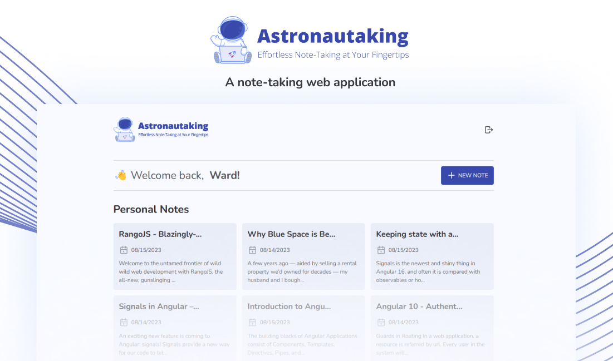
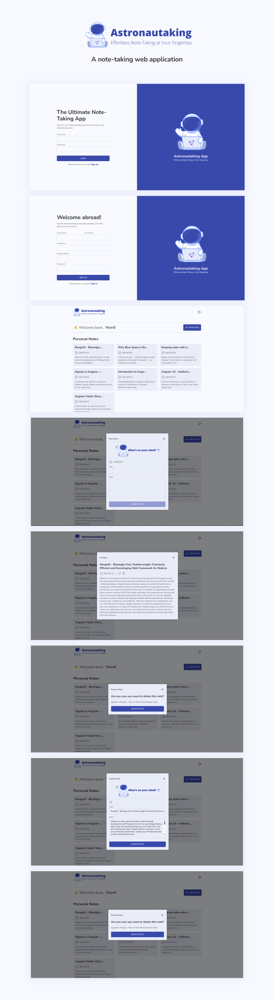
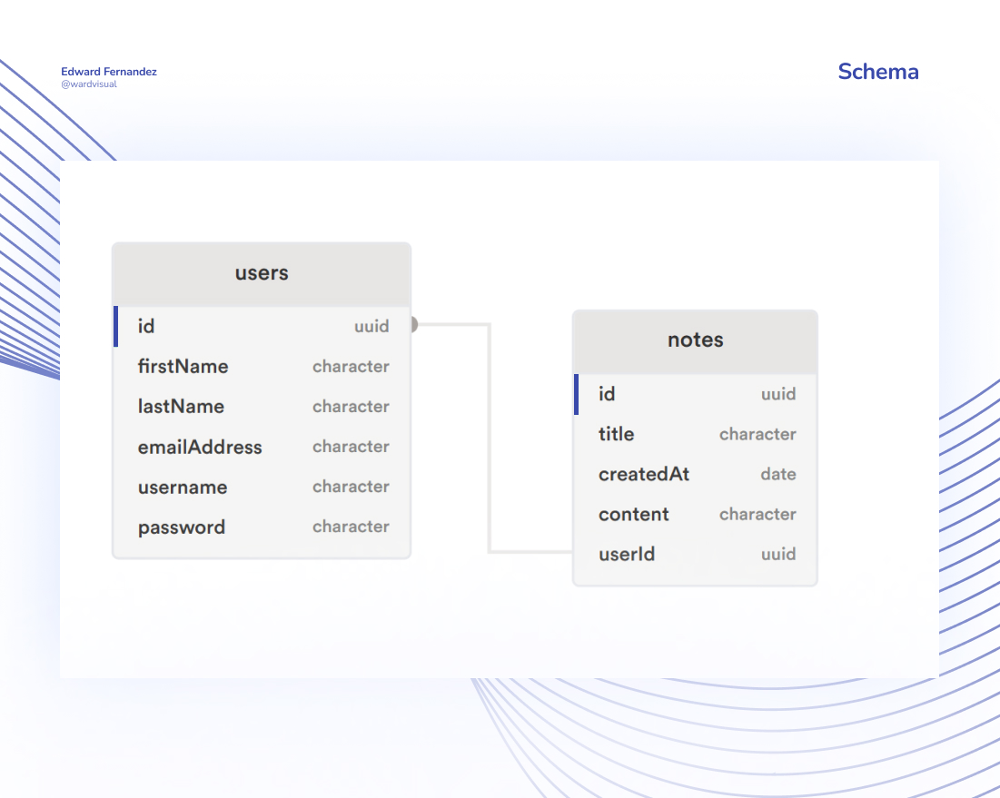

## Astronautaking App
Astronautaking is a powerful and user-friendly note-taking web application built with Angular 16 and Supabase. This app allows you to easily create, organize, and manage your notes in one convenient location.

### Built With:

- NPM - Package Manager
- Angular 16 - Frontend
- Supabase - Backend As A Service

### Design Overview:

### Basic Supabase Schema:

### License:

This project is licensed under the `LICENSE`.

## Contact

[Edward Fernandez](https://wardvisual.me/)
